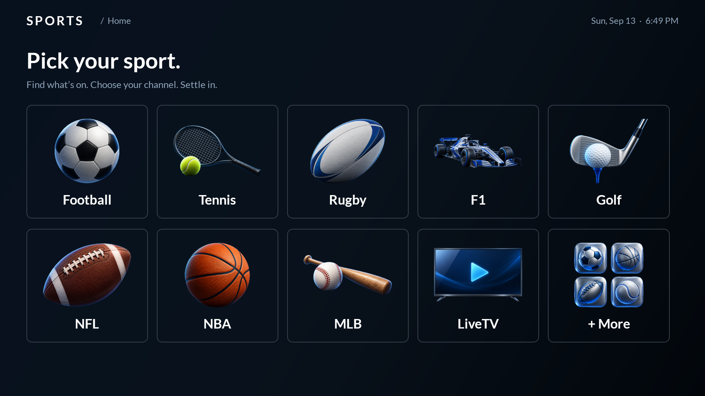

# Sports

Live sports and live TV, built for the big screen and your remote.

Browse matches by sport, see what's on now and coming up, choose a channel,
and watch in a fullscreen player. Or open **LiveTV** to browse channels by country.



## Features

- **Sports browsing** — Football, Tennis, Rugby, F1, Golf, NFL, NBA, and MLB on
  the home screen. More includes NHL, MMA, Boxing, Motorsport, College Football,
  Basketball, Volleyball, and Handball.
- **Clear schedules** — separate Current and Upcoming sections, local start
  times, countdowns, and league artwork.
- **LiveTV** — a country-based channel directory, with France, the United States,
  and the United Kingdom first.
- **Stream switching** — move between a channel's available streams from the player.
- **Made for a remote** — large tiles, visible focus, and Back navigation that
  returns you to your previous selection.
- **Native playback** — fullscreen video without the provider's web page or pop-ups.

Listings come from [FSL](https://freestreams-live1h.pk/). Channel availability
can vary, and commercials within broadcasts remain. The Current section is based
on scheduled start times and estimated event durations, rather than a live-status feed.

## Remote controls

| Button | Browse | Player |
| --- | --- | --- |
| Arrow keys | Move between tiles | Left/Right changes stream; Up shows controls; Down selects play/pause or Retry |
| OK | Open the selected item | Activate the selected control, or toggle playback when controls are hidden |
| Back | Return to the previous screen | Return to the channel list |
| Play/Pause | — | Toggle playback |

## Install

Requires Android TV 8.0 or later, Java 17+, Android SDK 36, Python 3, and ADB.
Set the SDK location in your local `local.properties` file:

```properties
sdk.dir=/path/to/Android/sdk
```

Build a signed APK:

```sh
make build
```

The APK is written to `release/Sports.apk`. To install on a TV reachable through
ADB, replace the example address with your TV's address:

```sh
make install ANDROID_TV_DEVICE=192.168.1.50
```

Installation does not launch the app. Open **Sports** from your TV's apps, or use
`make deploy ANDROID_TV_DEVICE=192.168.1.50` to install and launch it together.
An ADB device serial can also be used as `ANDROID_TV_DEVICE`.

The first build creates a local signing key in `keys/sports.jks` and its settings
in `signing.properties`. Keep both for future app updates; they are excluded from Git.

## Development

```sh
make check  # Core and Android UI tests, lint, and debug build
```

See [AGENTS.md](AGENTS.md) for the player architecture, source diagnostics, and
how to add support for another player format.

Artwork prompts and asset preparation are in [docs/artwork](docs/artwork).
The bundled Lato font is distributed under the [SIL Open Font License](licenses/Lato-OFL.txt).
